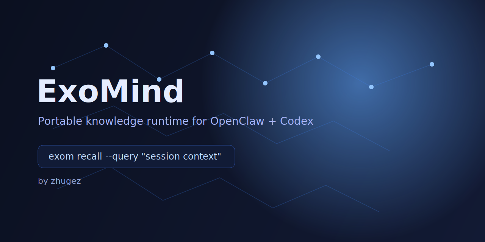

# ExoMind




Portable knowledge-method runtime that keeps OpenClaw/Codex agents tightly aligned with your own trusted data. ExoMind orchestrates local knowledge indexing, recall, and runtime health checks so that workflows can consume agent-ready context without leaking private notes.

## Why ExoMind?

- **Reliable context for agents** – build a term-graph of your knowledge store and let `exom recall` surface the right breadcrumbs for each session.
- **Operational peace of mind** – `exom doctor` and `exom index` ensure your runtime caches stay healthy and reproducible.
- **Integration-first** – designed to slot under OpenClaw and Codex orchestration layers with minimal fuss.

## Quickstart

### 1. Install the runtime (Rust-first)

Rust toolchains can install the CLI with:

```bash
cargo install --path .
```

Never built locally? run `cargo run --bin exom -- <command>` from the repo root instead.

### 2. Initialize your layout

If you want the opinionated workspace layout, bootstrap it once:

```bash
exom init --path .
```

or, while developing, use `cargo run --bin exom -- init --path .`.

### 3. Build a knowledge graph

Run `exom index` against your trusted knowledge root and point the output at `.neural`:

```bash
exom index --notes-root <YOUR_KNOWLEDGE_PATH> --out-root .neural
```

### 4. Recall context during agent sessions

Provide `exom recall` with your qualitative query, the graph, and a `topk` cutoff that matches your workflow:

```bash
exom recall --query "mamba eeg" --topk 10 --graph .neural/graph.json
```

### 5. Keep the runtime healthy

```bash
exom doctor --notes-root <YOUR_KNOWLEDGE_PATH> --graph .neural/graph.json
```

This command validates caches and surfaces missing pieces before each agent session.

### 6. Autocapture with typed relations

Capture quick observations from the CLI and let ExoMind append them to the inbox layout. By default a note lands at `00_Inbox/YYYY-MM-DD-auto.md`, and any `REL:TYPE(from->to)[confidence]` slices you provide are serialized into a fenced YAML block for downstream tooling.

```bash
exom capture --input "REL:CAUSED_BY(Demo->Spec)[0.75] outcome posted" --notes-root .
exom capture --file ./assets/synthetic/snippet.txt --out-note 00_Inbox/ci-capture.md --notes-root .
```

Swap `--input` for `--file`, override `--out-note` for a specific target, and append `--json` whenever you need machine-readable traces.

### 7. Memory lifecycle housekeeping

Tame stale inbox notes with `exom lifecycle`. The default `consolidate` mode rewrites `99_Archives/consolidated-YYYY-MM.md` with summaries of inbox files older than a few days, `--mode decay` appends deterministic `<!-- lifecycle last_reviewed=… decay_score=… -->` markers, and `--mode archive --older-than-days 30` moves long-lived notes into `99_Archives/Inbox`.

```bash
exom lifecycle --mode consolidate --notes-root . --json
exom lifecycle --mode archive --older-than-days 60 --notes-root .
```

`--notes-root` and `--json` behave consistently across capture, recall, doctor, benchmark, and lifecycle invocations.

## Hybrid recall & benchmark sample

`exom recall` uses a hybrid scoring model that blends token overlap with graph structure: nodes that share lexicon with the query and are referenced by multiple neighbors score higher. The sample dataset at `30_Resources/Schemas/benchmark-sample.json` is intentionally synthetic, showcasing how the hybrid recall signal balances lexical and relational context without any personal data.

Use the sample graph to verify hybrid recall behavior or to exercise the benchmark pipeline:

```bash
cargo run --bin exom -- recall --query "hybrid recall sample" --topk 3 --graph 30_Resources/Schemas/benchmark-sample.json
cargo run --bin exom -- doctor --notes-root 30_Resources --graph 30_Resources/Schemas/benchmark-sample.json
```

The dataset contains fictional nodes such as the "Hybrid Recall Concepts" note and a "Benchmark Execution Playbook," so the smoke runs remain safe for public CI while mirroring the real graph structure.

## Integration with OpenClaw & Codex

1. Keep the real knowledge in your own protected path (`--notes-root`).
2. Run `exom index` on schedule (cron or CI) so the cached graph stays in sync.
3. Feed `exom recall` output to Codex prompts or OpenClaw contexts; update `/root/.openclaw/workspace/skills/exomind-openclaw/scripts/exom.sh` to invoke `cargo run --bin exom`.
4. Use `exom doctor` before deploying new setup changes or when troubleshooting runtime drift.
5. Track infrastructure/configuration files in GitHub so collaborators can reproduce the runtime state.

## Repository layout

- `src/main.rs` – Rust-first CLI that powers `exom init/index/recall/doctor`
- `src/exomind/` – deprecated Python runtime for `serve`/`mcp` or compatibility scripts
- `scripts/` – Bootstrap helpers and compatibility bridges
- `.neural/` – generated cache files from `exom index` (gitignored)
- `00_Inbox/`, `10_Projects/`, `20_Areas/`, `30_Resources/`, `99_Archives/` – optional template folders inspired by the PARA method
- `Makefile` – convenience commands and aliases

## Legacy Python runtime (fallback)

The previous Python CLI still lives in `src/exomind/cli.py`. Install it with `pip install exomind`
or `pip install -e .` if you need the legacy `exom serve`/`exom mcp` helpers. Rust remains the preferred
path, and the Python artifacts exist mainly for compatibility.

## Contributing

See [`CONTRIBUTING.md`](CONTRIBUTING.md) for guidelines, issue templates, and testing expectations.

## License

This project is available under the MIT License. See [`LICENSE`](LICENSE) for details.
